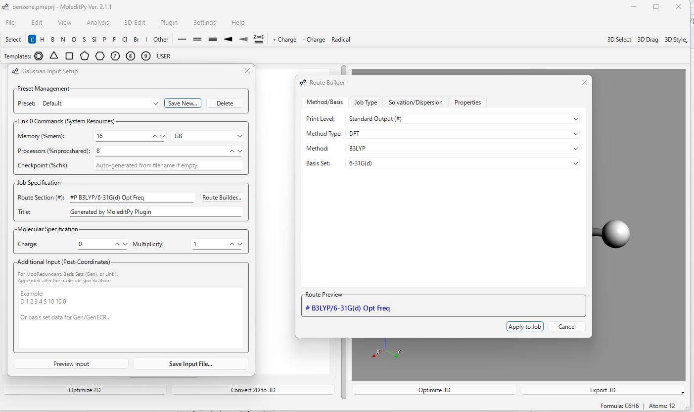
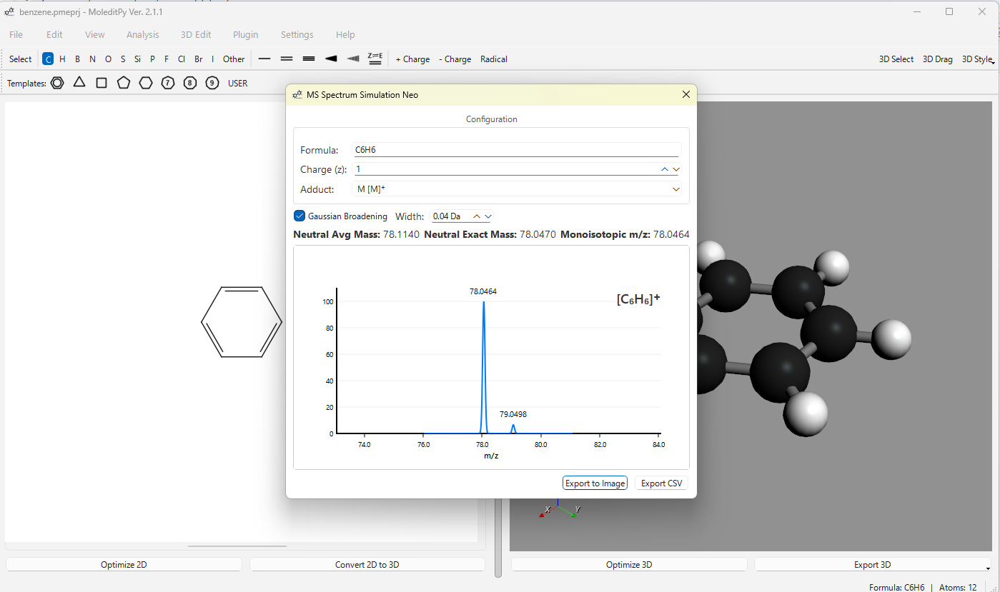
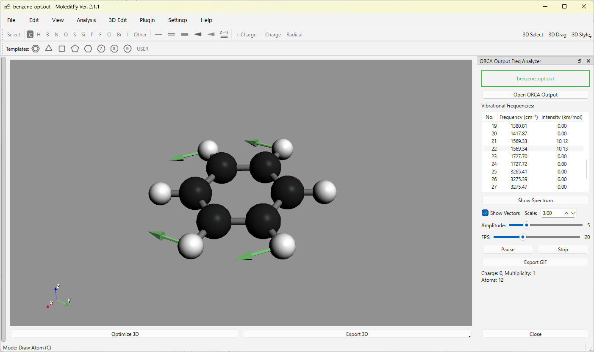
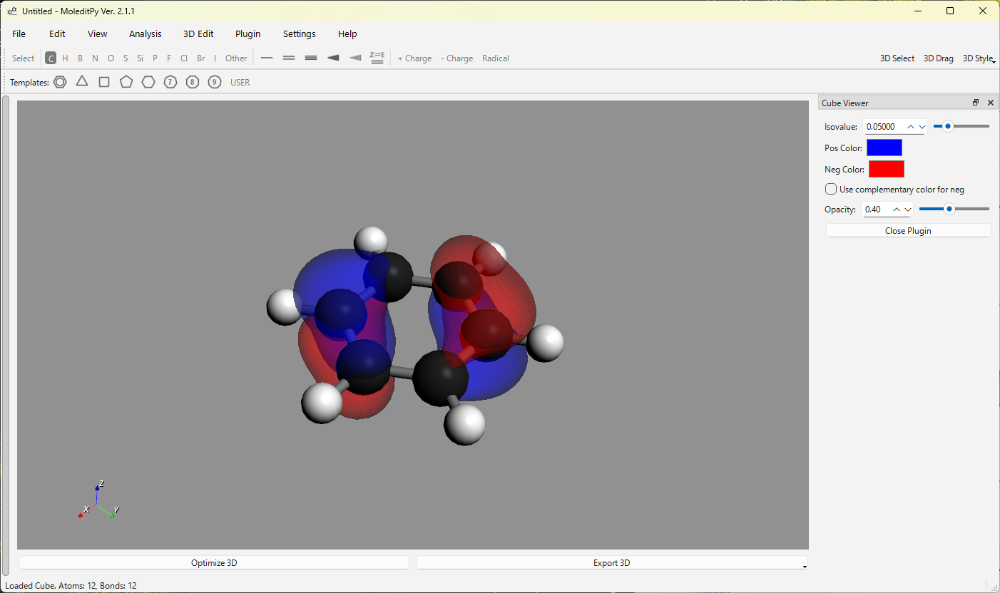
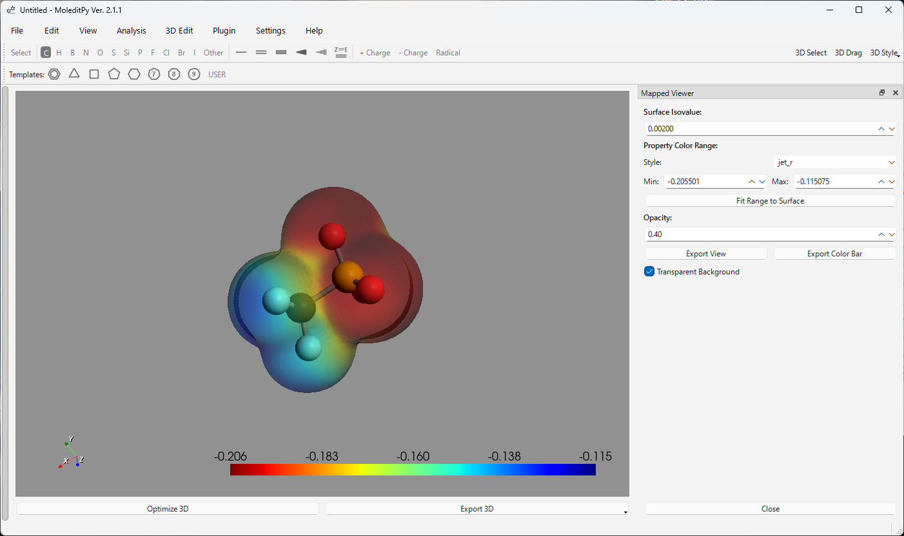

#  MoleditPy Plugin Collection

Repo: [https://github.com/HiroYokoyama/moleditpy-plugins/](https://github.com/HiroYokoyama/moleditpy-plugins/)  
Explorer: [https://hiroyokoyama.github.io/moleditpy-plugins/explorer/](https://hiroyokoyama.github.io/moleditpy-plugins/explorer/)


This directory contains the official plugins for **MoleditPy**. 

**Contribute Your Plugin**
We believe in the power of community\!  
If you have created a useful plugin, we would love to include it as an official part of this collection. Please feel free to submit a Pull Request with your plugin to help us expand what MoleditPy can do.

## Featured Plugins

### 1. Gaussian Input Generator Neo (`gaussian_input_generator_neo.py`)
High-functionality setting dialog for Gaussian input creation.
- **Features**: Supports Link 0, Route, Title, Charge/Mult, and appended data.
- **Dependencies**: `rdkit`, `PyQt6`

### 2. ORCA Input Generator Neo (`orca_input_generator_neo.py`)
High-functionality setting dialog for ORCA input creation.
- **Features**: Supports Link 0, Route, Block Builder, and Validations.
- **Dependencies**: `rdkit`, `PyQt6`

### 3. Gaussian Freq Analyzer (`gaussian_fchk_freq_analyzer.py`)
Analyzes vibrational frequencies from Gaussian FCHK files.
- **Features**: View IR spectrum, animate normal modes, and export GIF animations.
- **Dependencies**: `rdkit`, `PyQt6`, `numpy`, `Pillow`

### 4. ORCA Freq Analyzer (`orca_out_freq_analyzer.py`)
Analyzes vibrational frequencies from ORCA output files.
- **Features**: View IR spectrum, animate normal modes, and export GIF animations.
- **Dependencies**: `rdkit`, `PyQt6`, `numpy`, `Pillow`

### 5. MS Spectrum Simulation Neo (`ms_spectrum_neo.py`)
Simulates the Mass Spectrum for the currently loaded molecule using RDKit descriptors.
- **Features**: Includes Gaussian broadening and interactive zoom/pan.
- **Dependencies**: `rdkit`, `PyQt6`

### 6. Mapped Cube Viewer (`mapped_cube_viewer.py`)
Visualizes a property (e.g. ESP) mapped onto an isosurface (e.g. electron density) from two Cube files.
- **Dependencies**: `numpy`, `pyvista`, `PyQt6`, `rdkit`

### 7. Cube File Viewer (`cube_viewer.py`)
Visualizes Gaussian Cube files (.cube) containing volumetric data (e.g., orbitals, densities).
- **Features**: Renders isosurfaces with interactive controls for isovalue and color.
- **Dependencies**: `rdkit`, `pyvista`, `numpy`

### 8. PubChem Name Resolver (`pubchem_ressolver.py`)
Resolves chemical names and identifiers to structures using the PubChem PUG REST API.
- **Features**: Search by Name or SMILES, load directly into 2D editor.
- **Dependencies**: `requests`, `rdkit`

### 9. Animated XYZ Giffer (`animated_xyz_giffer.py`)
A player for viewing multi-frame XYZ files and recording GIF animations using PIL.
- **Dependencies**: `Pillow`

### Gallery

<p align="center">
  
</p>
<p align="center">
  
</p>
<p align="center">
  
</p>
<p align="center">
  
</p>
<p align="center">
  
</p>

## Installation

To install a plugin:

1.  Locate your MoleditPy plugins directory:
    -   **Windows**: `C:\Users\<YourUser>\.moleditpy\plugins`
    -   **macOS/Linux**: `~/.moleditpy/plugins`  
    *(If the directory does not exist, create it manually or run "Open Plugin Directory" in MoleditPy application once to generate it.)*

2.  Copy the desired `.py` file (e.g., `ms_spectrum.py`) from this repository into that `plugins` folder.

3.  Restart MoleditPy. The new plugin will appear in the "Plugins" menu.

## Development

You can create your own plugins by writing a Python script with a `run(main_window)` function.

```python
# example_plugin.py
from PyQt6.QtWidgets import QMessageBox

PLUGIN_NAME = "My Custom Plugin"

def run(main_window):
    # Access the current molecule via main_window.current_mol
    if main_window.current_mol:
        QMessageBox.information(main_window, PLUGIN_NAME, "Molecule loaded!")
    else:
        QMessageBox.warning(main_window, PLUGIN_NAME, "No molecule.")

# Optional: Run automatically on startup/reload
def autorun(main_window):
    print(f"{PLUGIN_NAME} initialized locally.")
```

### Advanced Features

1.  **Subdirectories**: You can organize your plugins into subfolders within the `plugins` directory. MoleditPy will automatically create nested menus corresponding to the folder structure.
2.  **Autorun**: Define a function named `autorun(main_window)` in your plugin. This function will be executed immediately when the plugin is loaded (on application startup or when "Reload Plugins" is clicked). This is useful for plugins that need to register their own menu items, toolbars, or event listeners without waiting for the user to click the plugin name in the menu.

### Security Warning

> [!WARNING]
> **Plugins run arbitrary Python code with the same privileges as the MoleditPy application.**
> 
> *   Only install plugins from sources you trust.
> *   Be especially cautious with plugins that use `autorun`, as they execute code immediately upon loading without specific user action.
> *   Review the plugin code (`.py` file) if you are unsure about its functionality.


