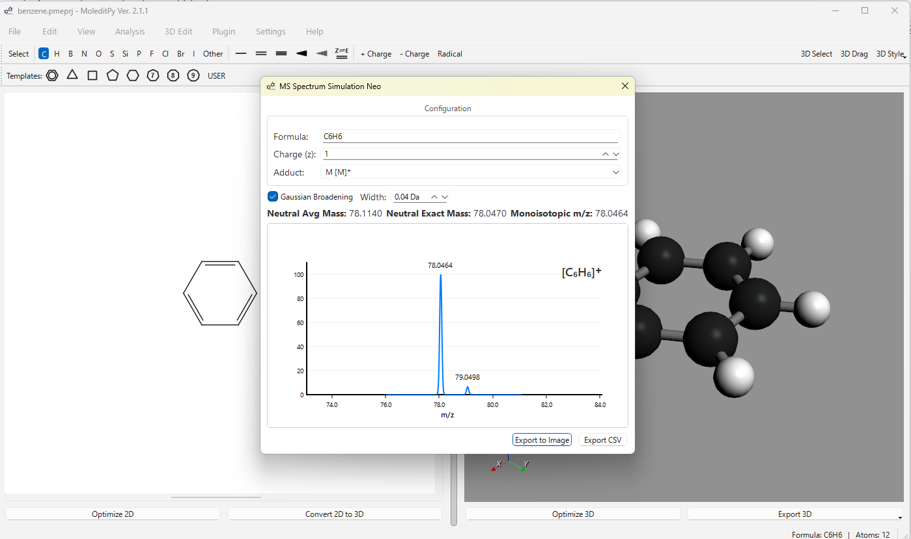
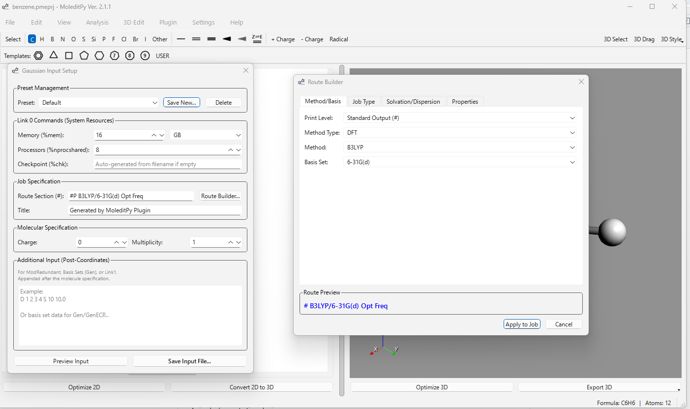
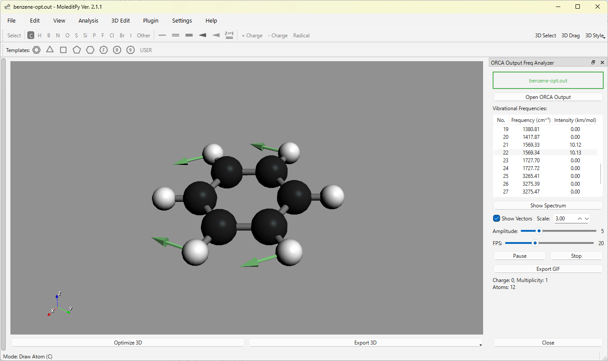
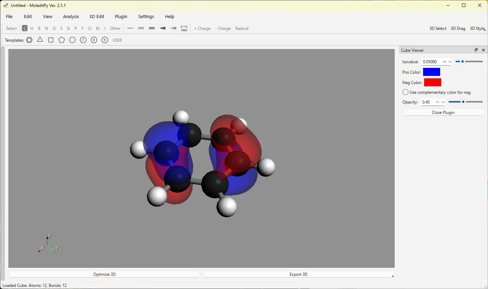
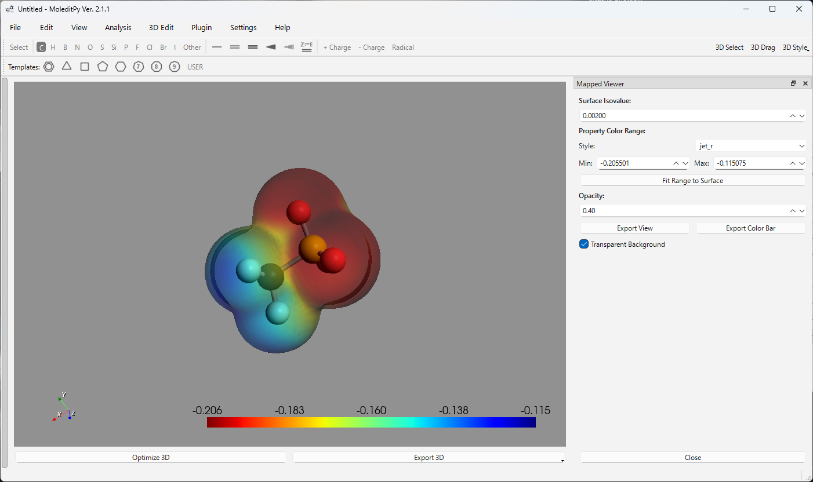

#  MoleditPy Plugins

[](https://github.com/HiroYokoyama/moleditpy-plugins/actions/workflows/test-plugins.yml)
[](https://doi.org/10.5281/zenodo.18140902)

Repo: [https://github.com/HiroYokoyama/moleditpy-plugins/](https://github.com/HiroYokoyama/moleditpy-plugins/)  
Explorer: [https://hiroyokoyama.github.io/moleditpy-plugins/explorer/](https://hiroyokoyama.github.io/moleditpy-plugins/explorer/)


This directory contains the official plugins for **MoleditPy**. 

> **Compatibility Note:** MoleditPy `3.0.0` introduced major refactoring, and MoleditPy `4.0.0` introduced further breaking changes; the plugins in this repository are updated for v4. Users who still need MoleditPy 3 can download plugins from the [2026.06.19-MoleditPy_3 tag](https://github.com/HiroYokoyama/moleditpy-plugins/tree/2026.06.19-MoleditPy_3); users who still need MoleditPy 2 can download plugins from the [2026.03.31-MoleditPy_2 tag](https://github.com/HiroYokoyama/moleditpy-plugins/tree/2026.03.31-MoleditPy_2).

**Contribute Your Plugin**
We believe in the power of community! If you have created a useful plugin, we would love to index it in our Official Plugin Explorer so the entire community can discover it. Please refer to our [CONTRIBUTING.md](CONTRIBUTING.md) for guidelines on how to submit your work.

## Featured Plugins

### 1. Gaussian Input Generator Pro (`gaussian_input_generator_pro/`)
Advanced Gaussian 16 input generator with real-time preview, route builder, and preset management.
- **Features**: Route Builder GUI (method/basis/solvation/TD-DFT/constraints), Z-matrix output, interactive 3D atom picking for ModRedundant scans, two-way constraint sync, `--Link1--` chained jobs, session persistence, syntax highlighting.
- **Dependencies**: `rdkit`, `PyQt6`
- **Repo**: [moleditpy_gaussian_input_generator_pro](https://github.com/HiroYokoyama/moleditpy_gaussian_input_generator_pro)

### 2. ORCA Input Generator Pro (`orca_input_generator_pro/`)
Advanced ORCA 5/6 input generator with real-time preview, keyword builder, and 22 block templates.
- **Features**: Keyword Builder GUI (method/basis/solvation/TD-DFT/constraints/NEB), interactive 3D atom picking for constraints & scans, DLPNO/CASSCF/NEVPT2/MRCI support, broken-symmetry DFT, 22 annotated block templates, round-trip `.inp` parsing, session persistence, syntax highlighting.
- **Dependencies**: `rdkit`, `PyQt6`, `numpy`
- **Repo**: [moleditpy_orca_input_generator_pro](https://github.com/HiroYokoyama/moleditpy_orca_input_generator_pro)

### 3. ORCA Result Analyzer (`orca_result_analyzer/`)
Comprehensive analysis and visualization of ORCA 5/6 calculation results — covers the full post-calculation workflow in a single plugin.
- **Features**: SCF convergence trace, MO levels + 3D cube isosurfaces, geometry optimisation/scan trajectory (click to update 3D structure), force vectors + convergence threshold graph, atomic charges (Mulliken/Loewdin/Hirshfeld/NBO), dipole moment, IR/Raman spectra + mode animation, thermochemistry (H/G/ZPE), TD-DFT absorption + CD spectra, NMR shieldings + J-coupling multiplet simulation, Mayer bond orders, NBO + E(2) perturbation, Post-HF energies (MP2/CCSD/CCSD(T)).
- **UX**: Drag-and-drop `.out` files, modeless windows, 3D viewer sync, copyable tables, session-persistent presets and NMR references.
- **Dependencies**: `rdkit`, `matplotlib`, `Pillow`, `pyvista`
- **Repo**: [moleditpy_orca_result_analyzer_plugin](https://github.com/HiroYokoyama/moleditpy_orca_result_analyzer_plugin)

### 4. PySCF Calculator (`pyscf_calculator/`)
Full quantum chemistry calculation suite powered by PySCF — no external Gaussian or ORCA installation required.
- **Features**: Single Point Energy (RHF, UHF, DFT), geometry optimisation, frequency analysis + thermochemistry, IR spectra, interactive 3D MO (HOMO/LUMO) and ESP-on-density visualisation.
- **Dependencies**: `pyscf`, `geometric`, `numpy`
- **Repo**: [moleditpy_pyscf-calculator](https://github.com/HiroYokoyama/moleditpy_pyscf-calculator)

### 5. xTB Optimizer (`xtb_optimizer.py`)
Fast semiempirical GFN2-xTB / GFN1-xTB geometry optimisation on a background thread — ideal pre-optimisation before DFT.
- **Features**: GFN1/GFN2-xTB method selection, ASE LBFGS integration, non-blocking UI with live log output + per-step energy table, Cancel button.
- **Dependencies**: `tblite`, `ase`

### 6. DECIMER Image Importer (`decimer_plugin/`)
Import chemical structures directly from PNG/JPG images of structure drawings using the DECIMER deep-learning model.
- **Features**: AI-powered SMILES prediction from hand-drawn or printed structure images, drag-and-drop support, `.png`/`.jpg`/`.jpeg` formats.
- **Dependencies**: `DECIMER`, `Pillow`

### 7. MS Spectrum Simulation Neo (`ms_spectrum_neo.py`)
Simulates the mass spectrum for the currently loaded molecule using RDKit descriptors.
- **Features**: Gaussian broadening, interactive zoom/pan, isotope pattern calculation.
- **Dependencies**: `rdkit`, `PyQt6`

### 8. Mapped Cube Viewer (`mapped_cube_viewer.py`)
Visualizes a scalar property (e.g., electrostatic potential) mapped as a colour gradient onto a molecular isosurface from two Gaussian Cube files.
- **Features**: Dual-cube input (isosurface + property), colour map selection (jet, RdBu, viridis, …), adjustable min/max range, per-vertex property mapping via PyVista, dockable panel with persistent settings.
- **Dependencies**: `pyvista`, `numpy`, `rdkit`

### 9. NICS Placer (`nics_placer/`)
Automatically places Bq ghost atoms at NICS(0) and NICS(1) probe positions for nucleus-independent chemical shift aromaticity calculations.
- **Features**: Auto ring detection via RDKit, ghost atoms at ring centroid (NICS(0)) and 1 Å above/below (NICS(1)), configurable ghost symbol (`Bq`/`H:`), directly compatible with ORCA Input Generator Pro's coordinate block, session persistence.
- **Dependencies**: `rdkit`

### 10. MCP Server (`mcp_server/`)
Expose MoleditPy to any MCP-compatible AI client — Claude Desktop, Claude Code, Cursor, Windsurf, VS Code Copilot, OpenAI Codex CLI, and more.
- **Features**: Load molecules by name (PubChem lookup), query/edit atoms and bonds, generate QM input files from live geometry, write/read files, reload plugins without restart, execute arbitrary Python on MoleditPy's main thread via `run_python`.
- **Dependencies**: `mcp`, `httpx`
- **Repo**: [moleditpy-mcp_server](https://github.com/HiroYokoyama/moleditpy-mcp_server)

### 11. Chat with Molecule Neo (`chat_with_molecule_neo.py`)

**The AI Copilot for MoleditPy (Powered by Google Gemini)**

Revolutionize your workflow with an AI agent that controls the editor directly. This plugin utilizes **Function Calling** to bridge natural language with chemical operations—loading structures, calculating descriptors, and generating expert-level ORCA inputs instantly.

* **Text-to-Structure:** Just say "Load Cubane" to generate 3D models.
* **Context-Aware:** Analyzes the active molecule in real-time.
* **Safe Execution:** Interactive [Accept]/[Reject] workflow for all AI actions.

[**Project Detail**](https://hiroyokoyama.github.io/moleditpy-plugins/plugins/Chat_with_Molecule_Neo/)

### Gallery

<p align="center">
  
</p>
<p align="center">
  
</p>
<p align="center">
  
</p>
<p align="center">
  
</p>
<p align="center">
  
</p>

## Installation

To install a plugin:

1.  Locate your MoleditPy plugins directory:
    -   **Windows**: `C:\Users\<YourUser>\.moleditpy\plugins`
    -   **macOS/Linux**: `~/.moleditpy/plugins`  
    *(If the directory does not exist, create it manually or run "Open Plugin Directory" in MoleditPy application once to generate it.)*

2.  **Copy the plugin files**:
    *   **Single File Plugin**: Copy the `.py` file (e.g., `ms_spectrum.py`) into the `plugins` folder.
    *   **Folder Plugin**: Copy the entire plugin folder (containing `__init__.py`) into the `plugins` folder.

3.  Restart MoleditPy. The new plugin will be automatically loaded.

## Development

MoleditPy features a robust plugin architecture allowing deep integration via the **PluginContext** API.

### Quick Start

Create a `.py` file with an `initialize(context)` function:

```python
PLUGIN_NAME = "My New Plugin"
PLUGIN_VERSION = "1.0"
PLUGIN_AUTHOR = "Your Name"

def initialize(context):
    # Register a menu action
    context.add_menu_action("My Plugin/Say Hello", lambda: print("Hello!"))
```

### Folder Plugins
For complex plugins, you can create a folder containing an `__init__.py` file instead of a single script. MoleditPy treats the folder as a single plugin package.

### Capabilities

The new API allows plugins to:
*   Add **Menu** and **Toolbar** items.
*   Register **Bond/Atom Color Overrides**.
*   Handle **File Drops** and custom **File Imports**.
*   Add custom **Export Options** and **Optimization Methods**.
*   Integrate **Analysis Tools** and persist data in **Project Files**.

For full documentation and examples, please refer to the [Plugin Development Manual (V4)](https://hiroyokoyama.github.io/python_molecular_editor/docs/PLUGIN_DEVELOPMENT_MANUAL_V4.html).

## License & Disclaimer

This project is licensed under the GNU General Public License v3.0 (GPLv3) - see the [LICENSE](LICENSE) file for details. As open-source software, it is provided 'as is' without warranty of any kind, and the author assumes no responsibility or liability for the results. Although outputs have been carefully verified, users are strongly encouraged to independently check and validate them for critical applications (such as publications). If you encounter any bugs, please open an issue.
