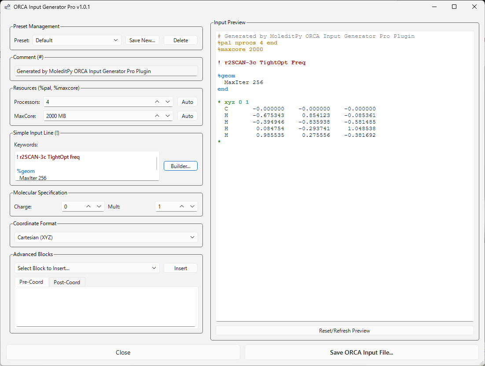
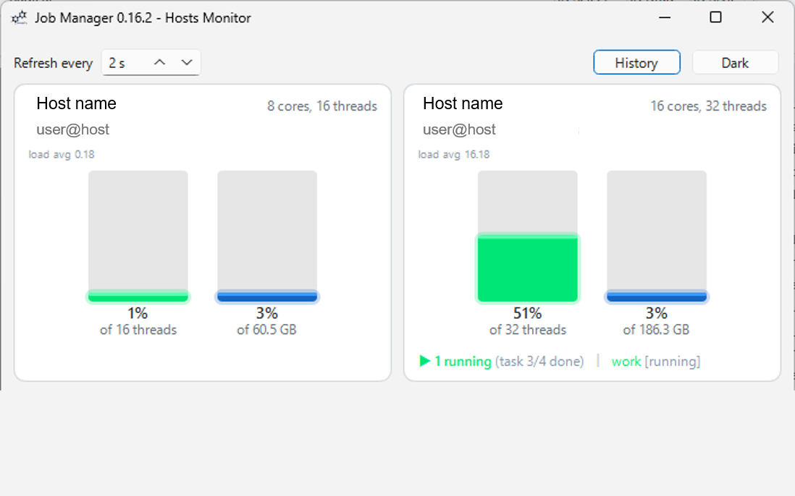
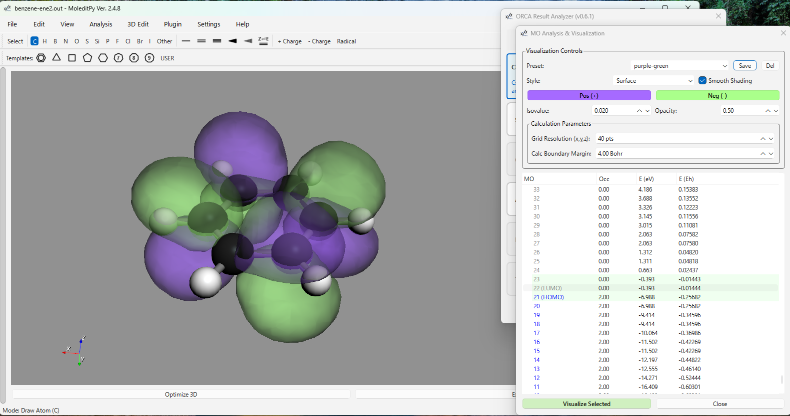
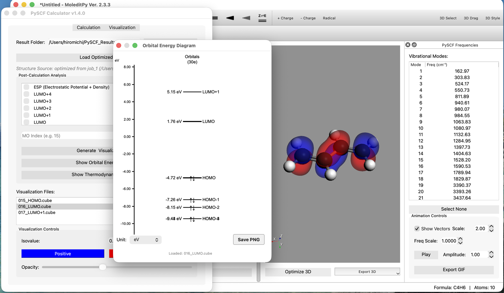
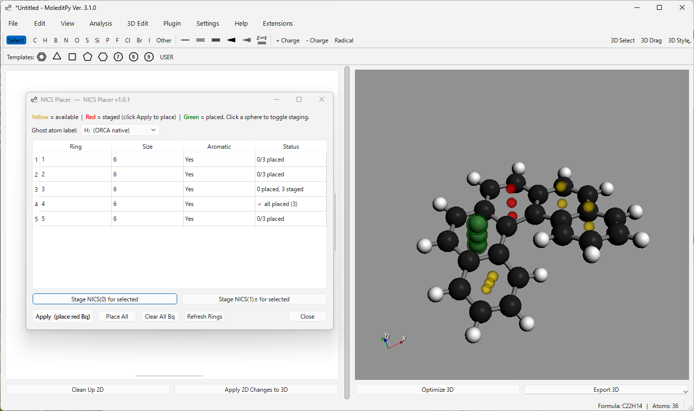
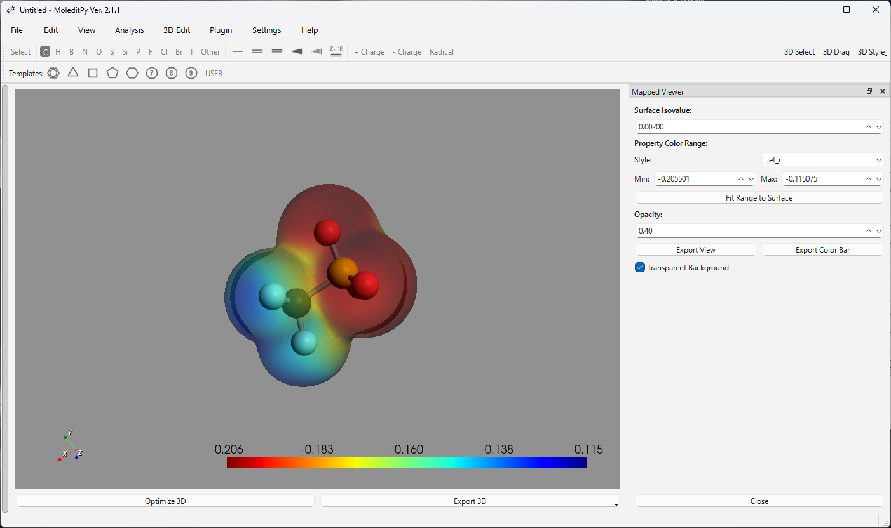

# MoleditPy Plugins

[](https://github.com/HiroYokoyama/moleditpy-plugins/actions/workflows/test-plugins.yml)
[](https://github.com/HiroYokoyama/moleditpy-plugins/actions/workflows/test-plugins.yml)
[](https://github.com/HiroYokoyama/python_molecular_editor)
[](https://hiroyokoyama.github.io/moleditpy-plugins/explorer/)
[](LICENSE)
[](https://doi.org/10.5281/zenodo.18140902)
[](https://github.com/sponsors/HiroYokoyama)

The official plugin collection for [MoleditPy](https://github.com/HiroYokoyama/python_molecular_editor): input generators for ten quantum-chemistry codes, result and cube-file analyzers, rendering exports, and AI integrations.

**[Website](https://hiroyokoyama.github.io/moleditpy-plugins/)** · **[Plugin Explorer](https://hiroyokoyama.github.io/moleditpy-plugins/explorer/)** · **[Plugin catalogue](https://github.com/HiroYokoyama/moleditpy-plugins/wiki/Official-Plugins)** · **[What you can do with plugins](https://github.com/HiroYokoyama/moleditpy-plugins/wiki/What-You-Can-Do-with-Plugins)**

<table>
  <tr>
    <td width="33%"><br><b>ORCA Input Generator Pro</b></td>
    <td width="33%"><br><b>Job Manager</b></td>
    <td width="33%"><br><b>ORCA Result Analyzer</b></td>
  </tr>
  <tr>
    <td><br><b>PySCF Calculator</b></td>
    <td><br><b>NICS Placer</b></td>
    <td><br><b>Mapped Cube Viewer</b></td>
  </tr>
</table>

## Featured plugins

| Plugin | What it does |
| :--- | :--- |
| [Gaussian Input Generator Pro](https://github.com/HiroYokoyama/moleditpy_gaussian_input_generator_pro) | Gaussian inputs with a route builder, presets, constraints, and a live preview |
| [ORCA Input Generator Pro](https://github.com/HiroYokoyama/moleditpy_orca_input_generator_pro) | ORCA 5/6 inputs with a keyword builder and annotated %block templates |
| [Job Manager](https://github.com/HiroYokoyama/moleditpy_job_manager) | Submits jobs to remote clusters over SSH, tracks the queue, and fetches results |
| [ORCA Result Analyzer](https://github.com/HiroYokoyama/moleditpy_orca_result_analyzer_plugin) | Orbitals, vibrations, TDDFT, NMR, charges, and more from ORCA output files |
| [PySCF Calculator](https://github.com/HiroYokoyama/moleditpy_pyscf-calculator) | Runs PySCF single points, optimizations, and frequencies, then shows orbitals and ESP (macOS, Linux, WSL) |
| [NICS Placer](https://github.com/HiroYokoyama/moleditpy_nics_placer) | Places Bq ghost atoms at NICS(0)/NICS(1) points or across a 2D/3D grid |
| [MCP Server](https://github.com/HiroYokoyama/moleditpy-mcp_server) | Lets AI assistants such as Claude Desktop drive MoleditPy over the Model Context Protocol |
| xTB Optimizer | GFN2-xTB / GFN1-xTB geometry optimization through tblite |
| Mapped Cube Viewer | Maps a property such as ESP onto an isosurface from two cube files |

All 80+ plugins, with their requirements and supported platforms, are listed in the [Plugin Explorer](https://hiroyokoyama.github.io/moleditpy-plugins/explorer/).

## Installation

The easiest way is the **Plugin Installer** plugin: download it from the [Plugin Explorer](https://hiroyokoyama.github.io/moleditpy-plugins/explorer/?q=Plugin%20Installer), open **Plugin › Plugin Manager…** in MoleditPy, and drag the file into the window. Then use **Plugin › Plugin Installer…** to browse, install, and update plugins; every download is checked against the SHA-256 recorded in the registry.

To install by hand, copy a plugin's `.py` file, or its folder containing `__init__.py`, into the plugin directory and restart MoleditPy:

- **Windows:** `C:\Users\<YourUser>\.moleditpy\plugins`
- **macOS / Linux:** `~/.moleditpy/plugins`

The plugins here target MoleditPy 4. For older versions, use the [MoleditPy 3 tag](https://github.com/HiroYokoyama/moleditpy-plugins/tree/2026.06.19-MoleditPy_3) or the [MoleditPy 2 tag](https://github.com/HiroYokoyama/moleditpy-plugins/tree/2026.03.31-MoleditPy_2).

## Writing a plugin

A plugin can be a single `.py` file with an `initialize(context)` function:

```python
PLUGIN_NAME = "My New Plugin"
PLUGIN_VERSION = "1.0"
PLUGIN_AUTHOR = "Your Name"

def initialize(context):
    context.add_menu_action("My Plugin/Say Hello", lambda: print("Hello!"))
```

For a new plugin, start from the [plugin template repository](https://github.com/HiroYokoyama/moleditpy-plugin-template), which includes headless tests, an API check against the application source, and a release workflow. The full API is in the [Plugin Development Manual (V4)](https://github.com/HiroYokoyama/python_molecular_editor/blob/main/docs/PLUGIN_DEVELOPMENT_MANUAL_V4.md). To list your plugin in the Explorer, see [CONTRIBUTING.md](CONTRIBUTING.md).

## Citation

If you use a plugin in your work, please cite it. Which DOI to cite depends on where the plugin lives:

| Plugin | Cite |
| :--- | :--- |
| **In-repo plugins** — everything under [`plugins/`](plugins/) in this repository | This collection: [](https://doi.org/10.5281/zenodo.18140902) |
| **External plugins** — plugins distributed from their own repository (e.g. ORCA Input Generator Pro, PySCF Calculator) | That plugin's own DOI, shown as the DOI badge in its repository's README |

Click the DOI to open its Zenodo record; the **Citation** box there gives a ready-to-paste citation string (APA, BibTeX and other styles).

For reproducibility, it is better to also mention the versions you used: the plugin's exact name and version (both shown in the Plugin Installer), and the MoleditPy version. For example, in a methods section:

> Isotope patterns of the molecular ions were simulated with the MS Spectrum Simulation Neo plugin (version 2026.09.24) from the MoleditPy Plugin Collection (version 2026.09.26) in MoleditPy 4.11.0.

with the reference taken from the Citation box, e.g.:

```
Yokoyama, H. (2026). MoleditPy Plugin Collection (Version 2026.07.24) [Computer software]. Zenodo. https://doi.org/10.5281/zenodo.21522477
```

Please also cite MoleditPy itself: [](https://doi.org/10.5281/zenodo.17268532)

## License & Disclaimer

This project is licensed under the GNU General Public License v3.0 (GPLv3) - see the [LICENSE](LICENSE) file for details. As open-source software, it is provided 'as is' without warranty of any kind, and the author assumes no responsibility or liability for the results. Although outputs have been carefully verified, users are strongly encouraged to independently check and validate them for critical applications (such as publications). If you encounter any bugs, please open an issue.
