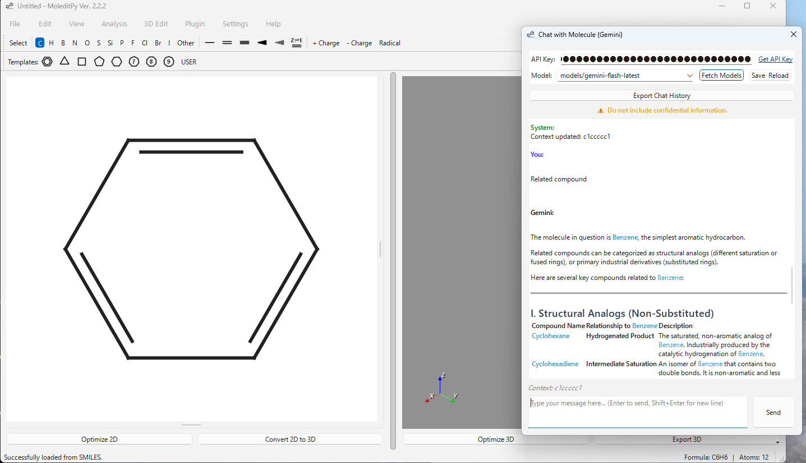
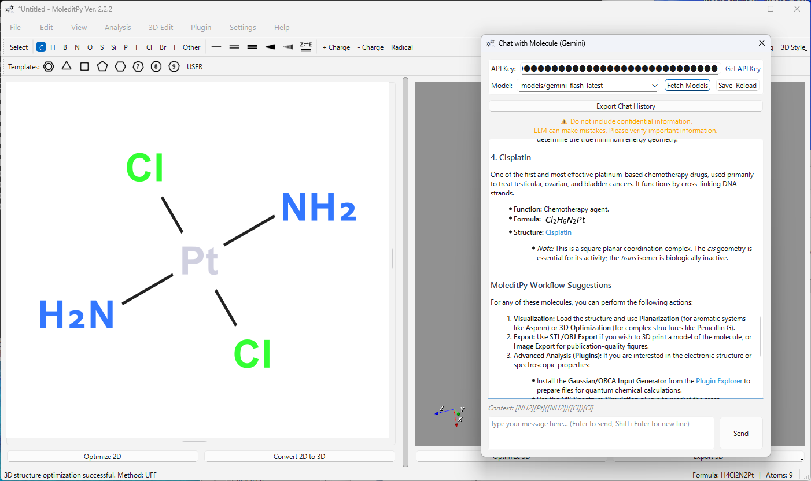

# Chat with Molecule (Gemini)

A plugin for MoleditPy that enables conversational interaction with the currently loaded molecule using Google's Gemini AI.





## Features

- **Context Awareness**: Automatically injects the SMILES string of the currently loaded molecule into the chat context.
- **Molecular Structure Recognition**: Instructions the AI to format molecular names as clickable links `[Name](smiles:...)` which automatically load the structure into the editor when clicked.
- **Model Selection**: Choose from available Gemini models (e.g., `gemini-1.5-flash`, `gemini-1.5-pro`).
- **History Export**: Export your chat session to a Markdown file.

## Installation

This plugin requires the `google-generativeai` and `markdown` Python packages.

1.  Open your terminal or command prompt.
2.  Run the following command:

```bash
pip install google.generativeai markdown
```

## Setup

1.  **Get an API Key**: Go to [Google AI Studio](https://aistudio.google.com/app/api-keys) and generate a free API key.
2.  **Enter Key**: Open the plugin in MoleditPy, paste your key into the "API Key" field, and click "Save & Reload".

## Usage

1.  Load a molecule in MoleditPy (or draw one).
2.  Open **Plugins > Chat with Molecule**.
3.  The "Context" label at the bottom will update to show the current SMILES string.
4.  Type your question (e.g., "What are the medicinal properties of this molecule?") and press Enter.
