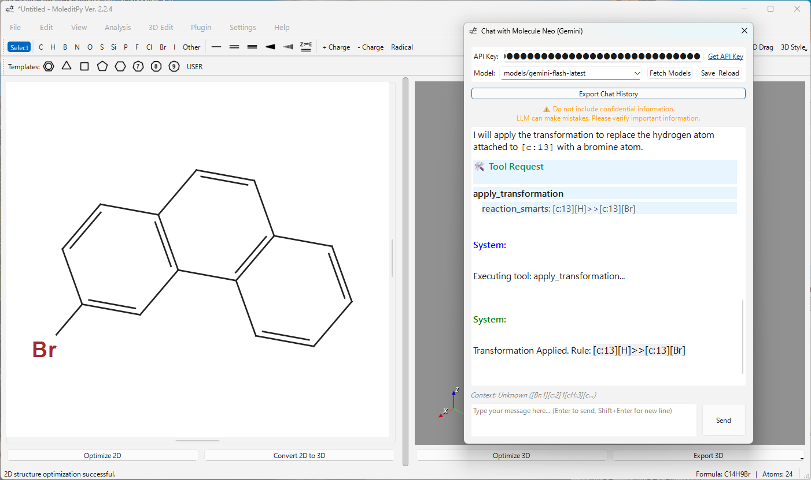
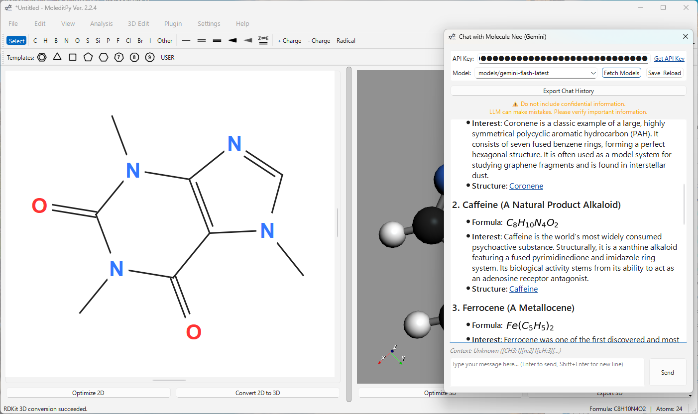
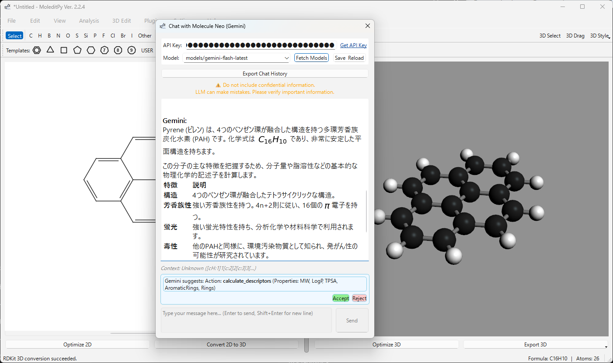
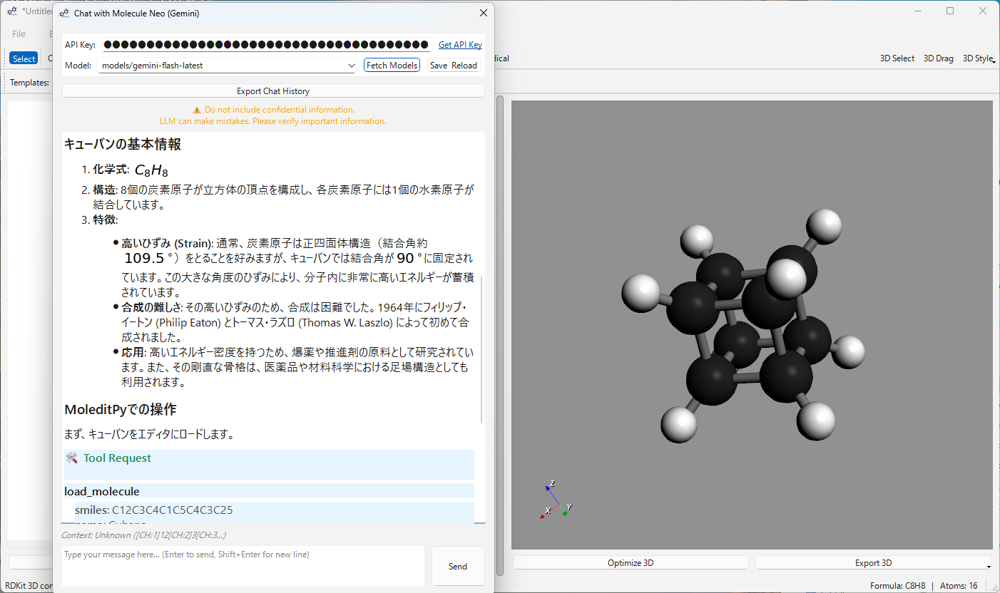

# Chat with Molecule Neo (Gemini)

[](https://www.python.org/)
[](https://aistudio.google.com/)

An advanced AI-powered assistant for **MoleditPy** that enables intelligent, conversational interaction with molecular structures using Google's Gemini API.






## Key Features

*   **Deep Context Awareness**: Automatically injects SMILES strings, atom map numbers, and user selections into the AI's reasoning engine.
*   **AI-Driven Structural Tools**: The assistant can autonomously modify molecules, highlight functional groups, and generate complex QM input files.
*   **PubChem Integration**: Seamlessly identifies molecules and fetches chemical data via the PubChem API.
*   **Visual Chemistry**: Native LaTeX rendering for chemical formulas and mathematical equations using Matplotlib.
*   **Interactive Links**: Molecular names are formatted as clickable `smiles:` links that load structures directly into the editor.

---

## AI Tool Suite

The AI assistant has direct access to the MoleditPy engine through a suite of 10 specialized tools:

| Tool | Capability |
| :--- | :--- |
| **Apply Transformation** | Perform chemical reactions via SMARTS patterns (e.g., chlorination, methylation). |
| **Calculate Descriptors** | Get MW, LogP, TPSA, HBD/HBA, and ring counts instantly via RDKit. |
| **ORCA Input Generator** | Create production-ready **ORCA** (`.inp`) input files with coordinates and headers. |
| **Gaussian Input Generator** | Create production-ready **Gaussian** (`.gjf`) input files with coordinates and headers. |
| **Load Molecule** | Directly load any molecular structure into the editor using a SMILES string. |
| **Highlight Substructure** | Visually identify functional groups or specific atom indices in the 3D viewport. |
| **Set Electronic State** | Precisely adjust formal charges and multiplicities for specific atoms. |
| **Convert to 3D** | Trigger MMFF94/UFF force-field optimizations and 3D visualization. |
| **Clear Canvas** | Reset the current workspace for a fresh start. |
| **Save Generic Files** | Generate and save scripts, CSVs, or custom coordinate files (XYZ, etc.). |

## Core Chemistry Toolkits

This plugin leverages industry-standard computational chemistry libraries:

*   **RDKit**: The primary engine for cheminformatics, handling SMILES parsing, SMARTS matching, coordinate generation, and property calculations.
*   **PubChem API**: Used for asynchronous chemical name resolution and structural identification via InChIKeys.
*   **Matplotlib (Agg)**: Provides the rendering engine for dynamic LaTeX-based math and chemical formula visualization in the chat UI.

---

## Installation

This plugin requires Python 3.10+ and the following dependencies:

```bash
pip install google-generativeai markdown matplotlib rdkit
```

> [!NOTE]
> `rdkit` is highly recommended for advanced molecular identification and SMARTS-based transformations.

## Setup

1.  **Get an API Key**: Obtain a free API key from [Google AI Studio](https://aistudio.google.com/app/api-keys).
2.  **Configuration**:
    *   Open MoleditPy.
    *   Navigate to **Plugins > Chat with Molecule Neo**.
    *   Paste your key into the **API Key** field.
    *   Select your preferred model (e.g., `gemini-1.5-pro` or `gemini-1.5-flash`).
    *   Click **Save & Reload**.

---

## Usage Examples

### 1. Molecular Modification
> **User**: "Add a nitro group to the para-position of the benzene ring."
> **AI**: *Analyzes the graph, identifies the para-carbon, and applies the transformation.*

### 2. Quantum Chemistry Setup
> **User**: "Prepare an ORCA input for a geometry optimization using B3LYP/def2-SVP."
> **AI**: *Generates the `.inp` file with correct atom coordinates and header directives.*

### 3. Property Analysis
> **User**: "Calculate the Lipinski's Rule of Five parameters for this molecule."
> **AI**: *Invokes the descriptor calculator and provides a detailed summary.*

---

## Aesthetics & UI

*   **Streaming Responses**: Real-time feedback as the AI generates its explanation.
*   **Safety First**: Built-in verification for tool execution and clear warnings for AI-generated content.

---

## Technical Architecture

Chat with Molecule Neo is built as a robust, non-blocking plugin using the following stack:

*   **GUI Framework**: Built with **PyQt6**, inheriting from `QDialog` to provide a secondary interactive window.
*   **Asynchronous Processing**: 
    *   `GenAIWorker (QThread)`: Handles streaming responses from the Google Gemini API to prevent UI hangs.
    *   `InitWorker`: Manages secure API configuration and model discovery.
    *   `QThreadPool`: Executes PubChem name resolution and property fetching in the background.
*   **Chemistry Engine**: Leverages **RDKit** for molecular graph analysis, SMILES generation, and SMARTS-based reaction execution.
*   **Secure Navigation**: Custom `ChatBrowser` subclass disables internal navigation to prevent page-clearing errors, handling `smiles:` and `http:` schemes via `QDesktopServices`.

## Integration Mechanics

The plugin deeply integrates with the **MoleditPy** core:

1.  **State Synchronization**: Uses a 2-second polling mechanism (or focus-triggered checks) to monitor `main_window.data.atoms` for structural changes or selection updates.
2.  **Context Injection**: Automatically constructs a system context including the current molecule's SMILES, InChIKey (resolved via PubChem), and specific atom selection indices.
3.  **Tool Execution Protocol**: The AI outputs JSON-formatted commands which are parsed and executed by the plugin against the live MoleditPy `MainWindow` instance, allowing for real-time canvas updates.

---

## Author

**HiroYokoyama**
Feel free to contribute or report issues via the [Plugin Explorer](https://hiroyokoyama.github.io/moleditpy-plugins/explorer/).
