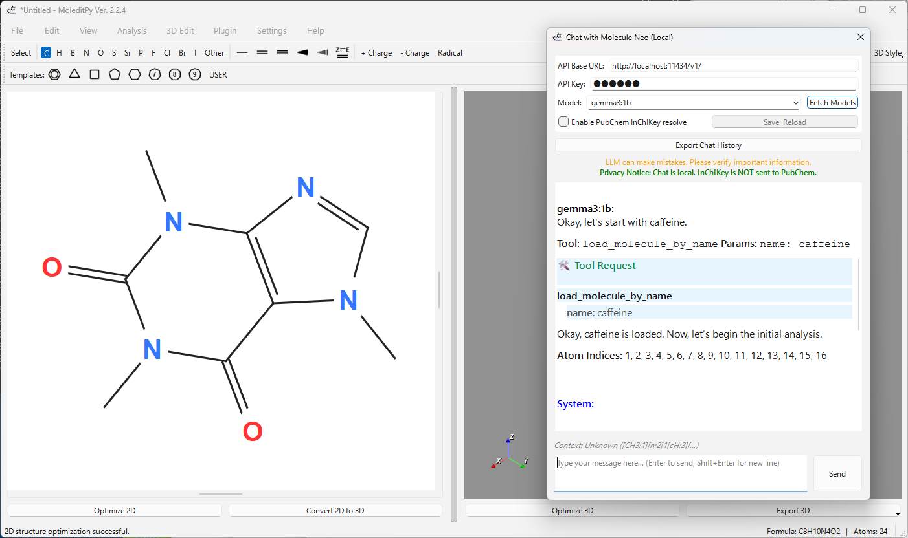

# Chat with Molecule Neo (Local)

**Author:** HiroYokoyama
**Download:** [Get Plugin](https://hiroyokoyama.github.io/moleditpy-plugins/explorer/?q=Chat+with+Molecule+Neo+%28Local%29)

 

## Overview
**Chat with Molecule Neo (Local)** is a plugin for **MoleditPy** that enables an integrated AI chat experience using local Large Language Models (LLMs) via an OpenAI-compatible API (like **Ollama**). 

It allows you to chat with an AI about the molecule currently open in the editor. The plugin automatically injects the molecule's SMILES string into the conversation context, allowing the AI to understand and manipulate the chemical structure. It also integrates with **PubChem** to resolve InChIKeys to common names if enabled.

## Features
- **Local AI Privacy**: Run the AI model entirely on your machine, ensuring that your chat data and confidential information remain local and secure.
- **Context-Aware**: Automatically detects the current molecule (SMILES) and user selection.
- **AI Capabilities**: The AI can perform actions like applying transformations, highlighting substructures, and calculating descriptors.
- **PubChem Integration**: Resolves InChIKeys to common names using PubChem (only the InChIKey is sent externally) if enabled.

## Requirements
- **MoleditPy** (Main Application)
- **Python Packages**:
  - `rdkit`
  - `PyQt6`
  - `openai`
  - `matplotlib`

Install the required Python package:
```bash
pip install openai matplotlib
```

## Setup Guide: Using with Ollama

This plugin is optimized for use with local runners like **Ollama**.

### 1. Install Ollama
Download and install Ollama from [ollama.com](https://ollama.com).

### 2. Pull a Model
Open your terminal or command prompt and pull a capable model.

```bash
ollama pull llama3
```

### 3. Start Ollama Server
Ensure the Ollama server is running. By default, it runs at `http://localhost:11434`.

```bash
ollama serve
```

### 4. Configure the Plugin
1. Open **MoleditPy** and launch the **Chat with Molecule Neo (Local)** plugin.
2. In the settings panel:
   - **API Base URL**: Set to `http://localhost:11434/v1`
   - **API Key**: Enter any string (e.g., `ollama`). The local server usually ignores this, but the client requires a value.
   - **Enable PubChem InChIKey resolve**: Check this box if you want to enable automatic name resolution via PubChem (requires internet).
3. Click **Fetch model**.
4. Select your model (e.g., `llama3`) from the dropdown list.
5. Click **Save & Reload**.

## Troubleshooting

- **"Connection Refused"**: Make sure Ollama is running (`ollama serve`).
- **"Model not found"**: Run `ollama list` in your terminal to see available models and ensure you have pulled the one you are trying to use.

